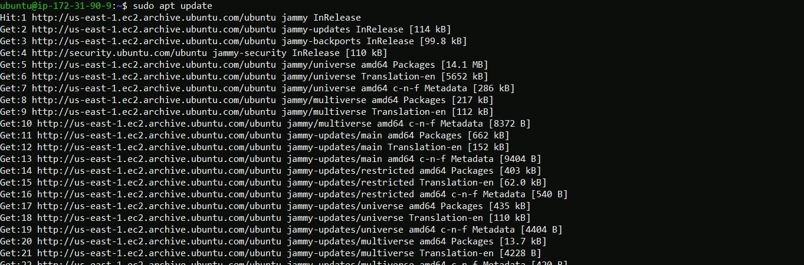
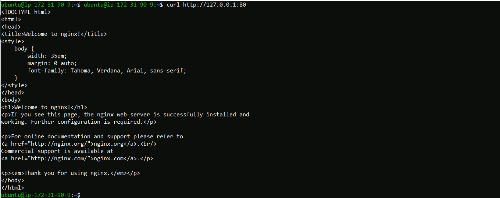
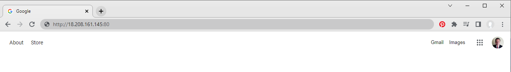
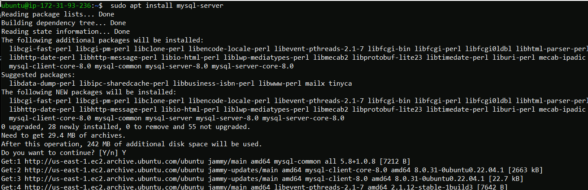
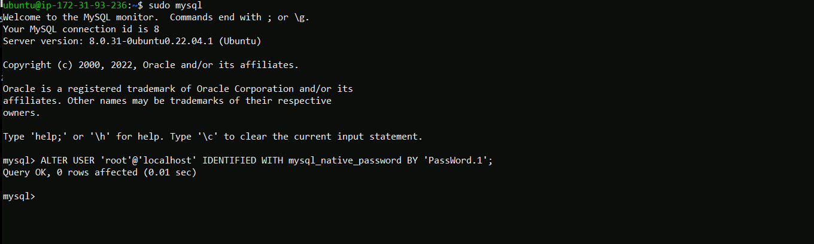
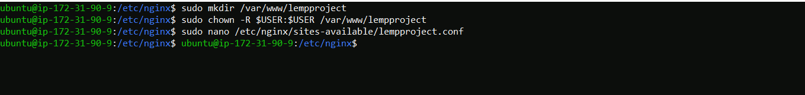
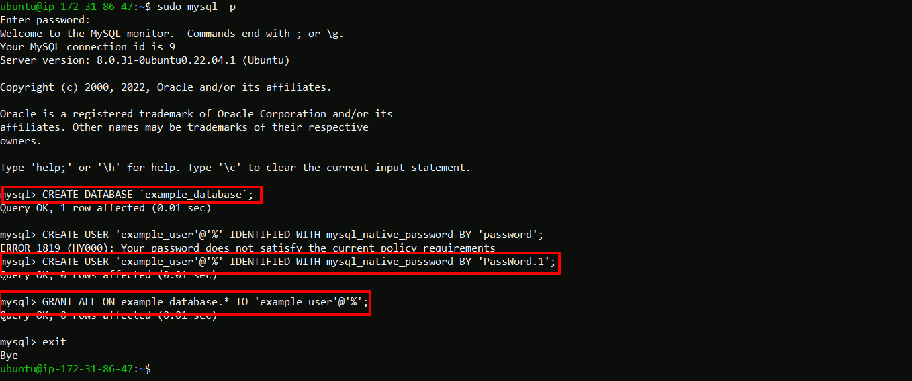
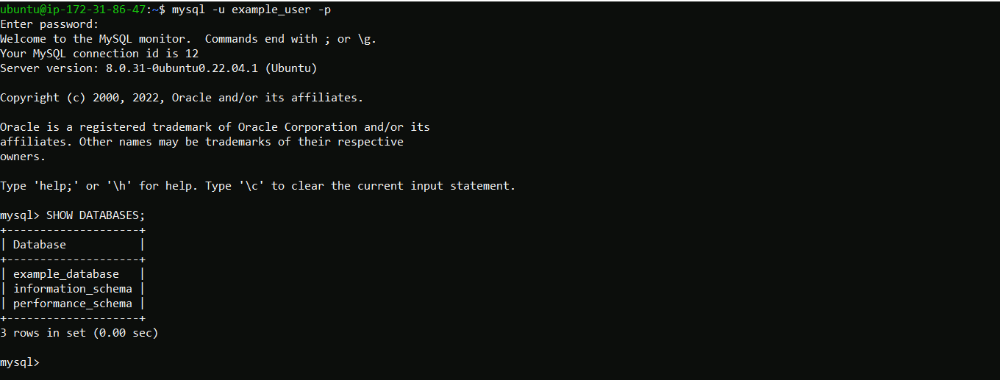

# <div align="center"> Installing a LEMP Stack in AWS / Project-2 </div>
#### LEMP is an open-source web application stack used to develop web applications. The term LEMP is an acronym that represents L for the Linux Operating system, NGINX (pronounced as engine-x, hence the E in the acronym) web server, M for MySQL database, and P for PHP scripting language.
___
###### * This project has a prerequistie of creating an Ubuntu EC2 instance on my personal AWS account. That instance has a security policy attached which allows me to log into it using SSH on port22 from my local laptop. The creation and setup of this instance is not documented here. 

### <div align="center"> Step 1) – Installing the Nginx Web Server </div>
After logging in to the new Ubuntu server from my local Windows terminal, I performed the following commnads to install NGINX
```
sudo apt update               # upate the servers package index
sudo apt install nginx        # install NGINX
```


__Confirm install by answering "y"__

__When the install procedure returns to the console prompt.. I ensure NGINX is active ---> See the green text active (running) status__


###### * I have edited my security group to allow inbound connections on HTTP TCP port 80 which is the default port that web browsers use to access web pages on the Internet.

First, I check if i can access my NGINX server locally from my Ubuntu shell using the command.
```
curl http://127.0.0.1:80
```
My NGINX web service responds to the ‘curl’ command with some payload.


Now it is time for me to test if my NGINX server can respond to requests from the Internet.
From my web browser I try to access the NGINX server with the following url
```
http://<Public-IP-Address>:80
```
I can find the public ip address of my web server with the following command from the console
```
curl -s http://169.254.169.254/latest/meta-data/public-ipv4
```
And use that IP address in my URL as follows:

My new NGINX server is responding to my requests over the Internet made from my local browser.


___
### <div align="center"> Step 2) - Installing MySQL </div>

Now that I have a web server up and running, I need to install a Database Management System (DBMS) to be able to store and manage data for my site in a relational database. MySQL is a popular relational database management system used within PHP environments, so I will use it in my project.
I use ‘apt’ run from the SSH session to acquire and install this software:
```
sudo apt install mysql-server
```

I then check if SQL is up and running after the install with the command
```
systemctl status mysql
```

Now i am able to login as root (which is inferred by the use of sudo) to the Mysql server from the remote console <br/>
At this time I will also set a password for the root user using the following commands

```
sudo mysql
```
This brings me to a mysql> prompt on the console
```
ALTER USER 'root'@'localhost' IDENTIFIED WITH mysql_native_password BY '******';
```


I then exit the mysql shell with the exit command
```
mysql> exit
```
At this point it is recommended that you run a security script that comes pre-installed with MySQL. This script will remove some insecure default settings and lock down access to your database system <br/>
In most of the configurations presented I provided the most restrictive responses


Now I test to see if i can log into mysql console with the previously configured password utilizing the ALTER USER command
```
sudo mysql -p
```

I am able to successfully login to my SQL server with the configured password
___
### <div align="center"> Step 3) - Installing PHP </div>
I’ll need to install php-fpm, which stands for “PHP fastCGI process manager”, and tell Nginx to pass PHP requests to this software for processing. 
In addition I will also need php-mysql, a PHP module that allows PHP to communicate with MySQL-based databases. <br/>
*PHP-FPM includes numerous features that can prove beneficial for websites receiving traffic in large volumes frequently*

To install these 2 packages at once, I will run: <br/>
Ad then check the version with php -v

```
sudo apt install php-fpm php php-mysql
```

___
### <div align="center"> Step 4 - Configuring NGINX to Use PHP Processor </div>
NGINX uses server blocks to host more than one domain on a single server.
I will create a new directory on the server to host my new website leaving the default NGINX domain directory in tact.
```
sudo mkdir /var/www/lempproject                          ### Ceate Web dcoument directory
sudo chown -R $USER:$USER /var/www/lempproject           ### Assign ownership of new Web docuemnt directory to curent system user
sudo nano /etc/nginx/sites-available/lempproject.conf    ### Create new configuration for NGINX's sites-availalble
```

Edit the contents of the new configuraion file - lempproject.conf
```
#/etc/nginx/sites-available/lempproject

server {
    listen 80;                                              # Defines what port NGINX will listen on
    server_name lempproject www.lempproject;                # Defines which domain names and/or IP addresses this server block should respond for.
    root /var/www/projectLEMP;                              # Defines the document root where the files served by this website are stored.

    index index.html index.htm index.php;                   # Defines in which order NGINX will prioritize index files for this website

    location / {                                            # The first location block includes a try_files directive
        try_files $uri $uri/ =404;
    }

    location ~ \.php$ {                                     #  This location block handles the actual PHP processing by pointing Nginx to the fastcgi-php.conf 
        include snippets/fastcgi-php.conf;
        fastcgi_pass unix:/var/run/php/php8.1-fpm.sock;
     }

    location ~ /\.ht {                                      # The last location block deals with .htaccess files, which Nginx does not process.
        deny all;
    }

}
```
Activate and test my configuration by linking to the config file from Nginx’s sites-enabled directory:
This will create a soft link to tell Nginx to use the configuration next time it is reloaded.
```
sudo ln -s /etc/nginx/sites-available/lempproject /etc/nginx/sites-enabled/
sudo nginx -t
```


Disable the default Nginx host that is currently configured to listen on 
```
sudo unlink /etc/nginx/sites-enabled/default
```

Now I will create an index.html file in my /var/www/lempproject folder so that I can test that the virtual host works as expected:

```
sudo echo 'Hello LAMP from hostname' $(curl -s http://169.254.169.254/latest/meta-data/public-hostname) 'with public IP' <br/> 
$(curl -s http://169.254.169.254/latest/meta-data/public-ipv4) > /var/www/lempproject/index.html
```
My Apache virtual host is working as expected. I can access it from my local machines browser using it's DNS name.


 In the next step, i will create a PHP script to test that Nginx is in fact able to handle .php files within my newly configured website.
___
### <div align="center"> Step 5) - Testing PHP with Nginx </div>

Now I need to test if my new NGINX server can handle a PHP file.<br/>
I can do this by creating a file called 'info.php' inside my new domains web directory

```
sudo nano /var/www/lempproject/info.php
```
Then entering the following code into that file

```
<?php
phpinfo();
```

This is valid PHP code that will return information about my server.

My local browser is successful in retrieving data from my new NGINX webserver utilizing PHP interpreter


### <div align="center"> Step 6) - Retrieving data from MySQL database with PHP </div>

__In ths step I will create a test SQL database to prove the NGINX website can query data from the database__

I Created a database , created a new database user and gave that new user access to the database
```
mysql> CREATE DATABASE `example_database`;
mysql>  CREATE USER 'example_user'@'%' IDENTIFIED WITH mysql_native_password BY 'PassWord.1';
mysql> GRANT ALL ON example_database.* TO 'example_user'@'%';
```


Now I test that my new database user 'example_user' can access the database locally.


While loogged in locally to the example_datbase as the example_user, I have created a table named todo_list and enterd some lines of data.


Then created a PHP script that will connect to MySQL and query for my content. <br/>
Create php file in my web folder
``
nano /var/www/lempproject/todo_list.php
```
Enter the foloing lines of code in to the new php file.
```
<?php
$user = "example_user";
$password = "password";
$database = "example_database";
$table = "todo_list";

try {
  $db = new PDO("mysql:host=localhost;dbname=$database", $user, $password);
  echo "<h2>TODO</h2><ol>";
  foreach($db->query("SELECT content FROM $table") as $row) {
    echo "<li>" . $row['content'] . "</li>";
  }
  echo "</ol>";
} catch (PDOException $e) {
    print "Error!: " . $e->getMessage() . "<br/>";
    die();
}
```

Then i tested that the MySQL database data can be accessed over the Internet via the PHP Interpreter.
Successfully retrieved the data over teh Internet via a web browser.


