## This project requires implementing a web solution based on a MERN stack in the AWS Cloud.
### A __MERN__ Web stack consists of following components: <br/>

__* MongoDB:__ A document-based, No-SQL database used to store application data in a form of documents. <br/>
__* ExpressJS:__ A server side Web Application framework for Node.js. <br/>
__* ReactJS:__ A frontend framework developed by Facebook. It is based on JavaScript, used to build User Interface (UI) components. <br/>
__* Node.js:__ A JavaScript runtime environment. It is used to run JavaScript on a machine rather than in a browser. <br/>

###### * This project has a prerequistie of creating an Ubuntu EC2 instance on my personal AWS account. That instance has a security policy attached which allows me to log into it using SSH on port22 from my local laptop. The creation and setup of this instance is not documented here. 

## BACKEND CONFIGURATION

### Install the latest versions of all packages on the Ubuntu server.
   
 * __Run update to fetch the updated metadata on the packages.__ <br/>
 `sudo apt update`


* __Run Upgrade to get packages on the newest versions__ <br/>
`sudo apt upgrade`


### Install Node.js on the server and setup the application code
* __Locate the Node.js software on the Ubuntu repositories with the following command.__ <br/>
`curl -fsSL https://deb.nodesource.com/setup_18.x | sudo -E bash - `


* __Application code setup (install node.js)__ <br/>
_The following command  installs both nodejs and npm. NPM is a package manager for Node like apt for Ubuntu_ <br/>
`sudo apt-get install -y nodejs`


* __Verify the installation of both NPM and nodejs. Then create a ToDo folder for my project application.__ <br/>
`node -v` <br/>
`npm -v` <br/>
`mkdir ToDo` <br/>


* __Initialize the project and create all the base needed components__ <br/>
`npm init`
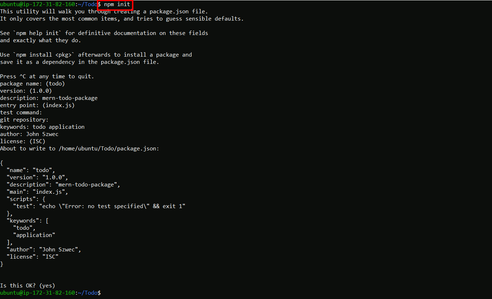

* __Verify the existence of the Package.json file that was created by the init procedure__ <br/>
`cat package.json`


## INSTALL EXPRESSJS <br/>
* __Install expressjs and create an index.js file__ <br/>
*Expressjs is a framework layer built on the top of the Node js that helps manage servers and routes.* <br/>
`npm install express` <br/>
`touch index.js` <br/>


* __Install the dotenv module__ <br/>
*DotEnv is a lightweight npm package that automatically loads environment variables from a .env file into the process.env object.* <br/>
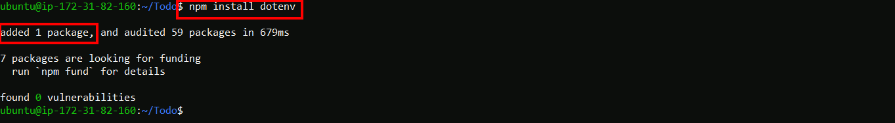

* __Edit the index.js file with the following code__ <br/>
 *index.js is the "entry point" for my new nodejs application* <br/>
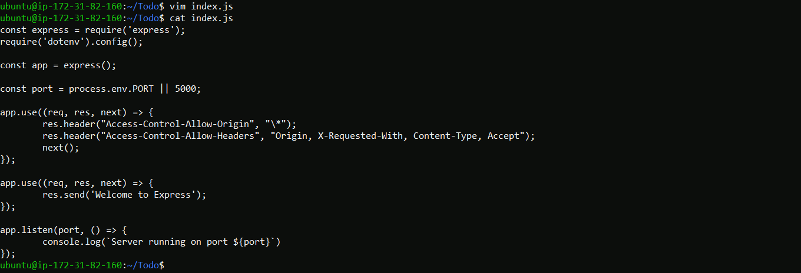

* __Start the new nodejs applciaiton listening on TCP port 5000__ <br/>
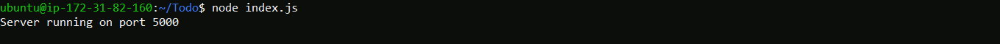

* __Allow port 5000 on the security rules attached to the server instance which hosts my new application__ <br/>
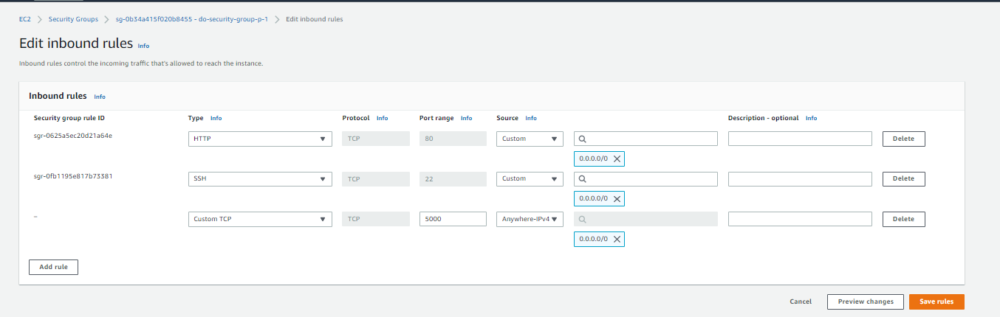

* __Access the new application from a local web browser on port 5000__ <br/>
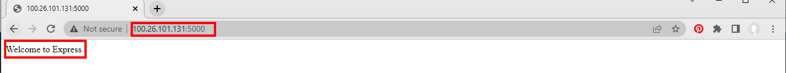

* __Create the routes folder, also create and edit the api.js file in that new folder__ <br/>
*A route is a section of Express code that associates an HTTP verb (GET, POST, PUT, DELETE, etc.), a URL path/pattern, and a function that is called to handle that pattern.*
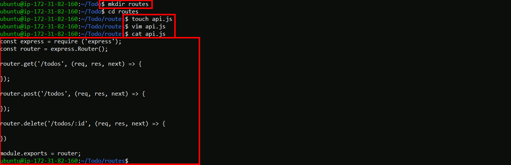

## CREATING A MODEL <br/>
*A schema is fundamentally describing the data construct of a document.* <br/>
*A model is a compiled version of the schema. One instance of the model will map to one document in the database.*
* __Install Mongoose to provide functionality around creating and working with the schemas.__ <br/>
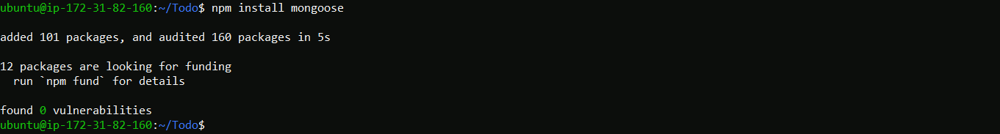

* __Create the models folder, also create and edit the ToDo.js file in that new folder__ <br/>
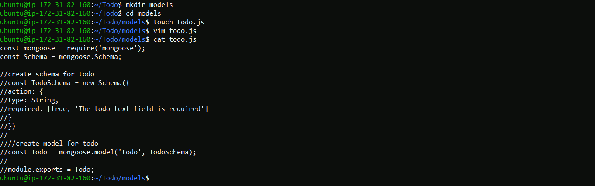

* __Edit the api.js file in the routes folder as follows__ <br/>
*This code will be used to define the action taken when a sepcific endpoint is called.*
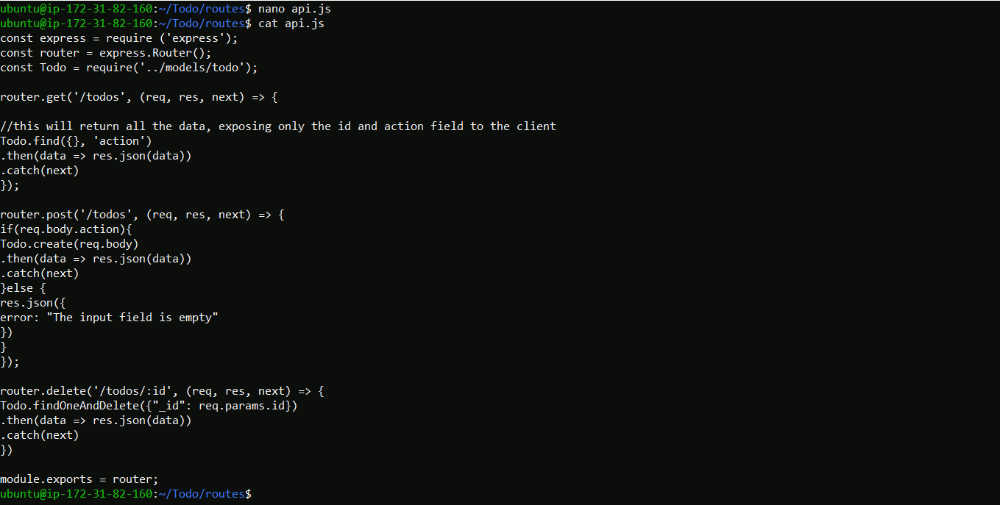

## MONGODB DATABASE CREATION & TESTING FUNCTION with POSTMAN <br/>
*For my project I will need a mongodb database where I will store my data. <br/>
For this I will make use of mLab. mLab provides MongoDB database as a service solution (DBaaS).*

### The creation steps of the MongoDB are as follows. <br/>
* Create a MongoDB cluster frm the mlab website. <br/>
*In the context of MongoDB, “cluster” is the word usually used for either a replica set or a sharded cluster. <br/>
A MongoDB Atlas Cluster is a NoSQL Database-as-a-Service offering in the public cloud.*


* Create a MongoDB database and collection. <br/>
*A collection is a grouping of MongoDB documents. Documents within a collection can have different fields. <br/>
A collection is the equivalent of a table in a relational database system. A collection exists within a single database*


* __Retrieve the  connection string from cluster in order to access the mlab DB from the application.__ <br/>
*The connection string is provided by mlab.* <br/>
Click on connect from the cluster and choose connect your application. <br/>
Copy the connection string and save it in a notepad for later.
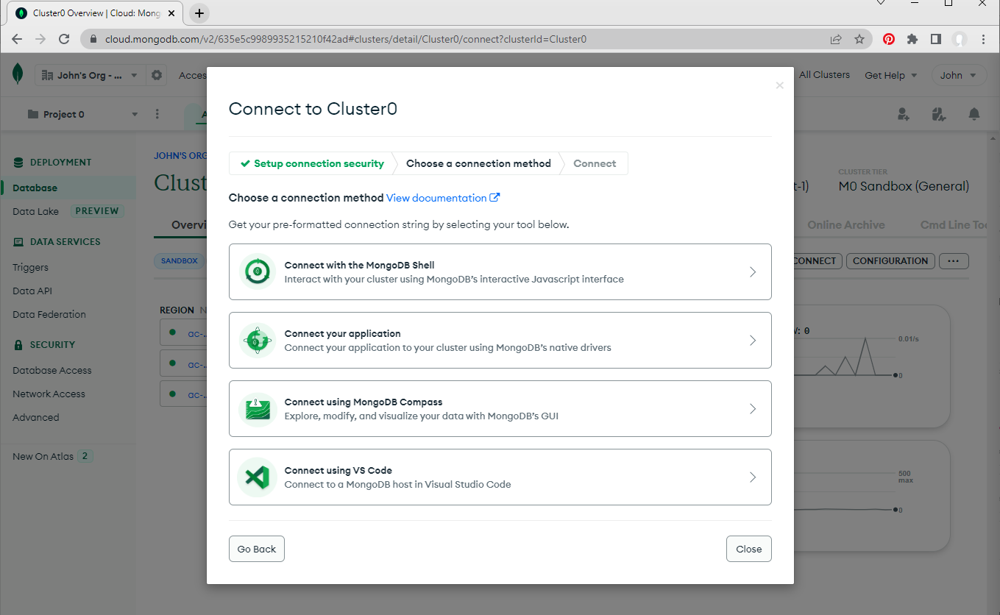
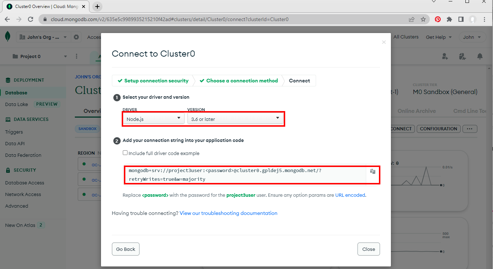

* __The connection string will be entered into a newly created .env file__ <br/>
Copy the connection string into a newly created .env file located in the Todo folder on the AWS EC2 instance. <br/>
*The index.js file will reference this .env file in order to connect to the mlab MongoDB* <br/>
I need to change the username, password, and database values to the ones actually created before saving the .env file.

* __Edit the index.js file to reflect the use of the .env file so that Node.js can connect to the database__ <br/>
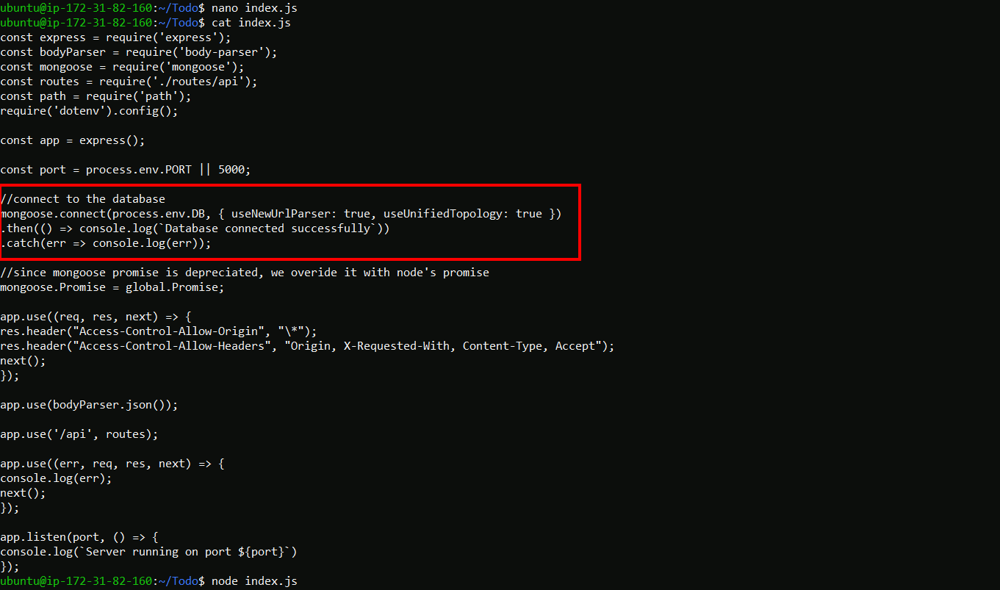

* __Now that my new MongoDB is created and defined I can start the application__ <br/>
`
node index.js
`


### Utlilizing POSTMAN in order to test the backend code of the application. <br/>
*Postman is a tool used to dissect RESTful APIs made by others or test ones you have made yourself*

* __In the next steps I will POST, GET, and DELETE data in my new MongoDB database utilizing Postman__ <br/>
I make a couple of individual posts to the MongoDB. (only one post is illustrated in this document.)


* __Use the GET function from Postman to test if I can retrieve the data just posted.__
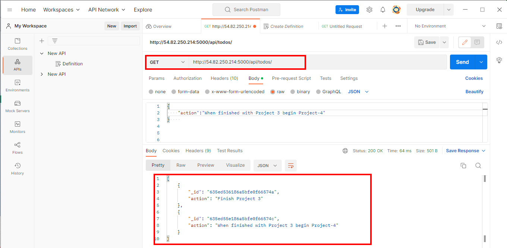

* __The next step is to check the MongoDB to prove the records now exist.__


* __Now DELETE one of the records.__


* __Check the MongoDB once again to see if the record was actually deleted.__ <br/>
*Checking the datbase I see only one record now exists*
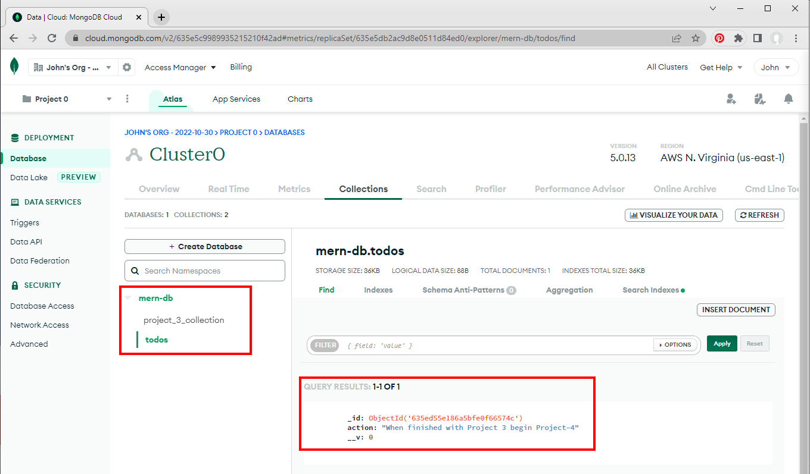

## FRONTEND CREATION <br/>

* __Create the React application.__ <br/>
*Cerate React app sets up an assortment of basic web app elements; commands to test, build, and serve your app.* <br/>
`npx create-react-app client` <br/>


* __Install React dependencies - Concurrently and nodemon__ <br/>
Run the following command to install concurrently.
*concurrently is used to run more than one command simultaneously from the same terminal window.* <br/>
`npm install concurrently --save-dev` <br/>
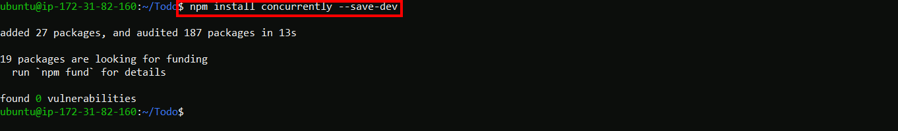

* __Run the following command to install nodemon.__ <br/>
*nodemon is used to run and monitor the sever.* <br/>


* __Configure the package.json file located in the main application folder to piont to the newly installed react components .__ <br/>


* __Configure the package.json file located in the client folder which was created when I installed *create-react-app*.__ <br/>
*The purpose of adding the proxy configuration makes it possible to access the application directly from the browser by simply calling the server url like http://localhost:5000 rather than always including the entire path like http://localhost:5000/api/todos*


* __Start the applcation from the main app folder.__ <br/>
`npm run dev` <br/>
*The server starts and is listening on port 3000*


* __Set the inbound security rules on the EC2 instance hosting the application.__ <br/>
* *Allow TCP port 3000*


* __Create React Components__ <br/>
*Components are independent and reusable bits of code. They serve the same purpose as JavaScript functions, but work in isolation and return HTML. <br/>
When creating a React component, the component's name MUST start with an upper case letter.*
These three new component files will be created inside the create-react-app client folder as follows <br/>
`<top-level-application-directory>/client/src/components/`


* __Enter the following code into the Input.js component__ <br/>
```
import React, { Component } from 'react';
import axios from 'axios';

class Input extends Component {

state = {
action: ""
}

addTodo = () => {
const task = {action: this.state.action}

    if(task.action && task.action.length > 0){
      axios.post('/api/todos', task)
        .then(res => {
          if(res.data){
            this.props.getTodos();
            this.setState({action: ""})
          }
        })
        .catch(err => console.log(err))
    }else {
      console.log('input field required')
    }

}

handleChange = (e) => {
this.setState({
action: e.target.value
})
}

render() {
let { action } = this.state;
return (
<div>
<input type="text" onChange={this.handleChange} value={action} />
<button onClick={this.addTodo}>add todo</button>
</div>
)
}
}

export default Input
```
* __From the clients folder I install Axios.__ <br/>
*Axios is an HTTP client library based on promises. It makes sending asynchronous HTTP requests to REST endpoints easier and helps you perform CRUD operations*


* __Edit the ListTodo.js file__ <br/>
*Back in the folder `<top-level-application-directory>/client/src/components/`* <br/>
I enter the following code in to the ListTodo.js file
```
import React from 'react';

const ListTodo = ({ todos, deleteTodo }) => {

return (
<ul>
{
todos &&
todos.length > 0 ?
(
todos.map(todo => {
return (
<li key={todo._id} onClick={() => deleteTodo(todo._id)}>{todo.action}</li>
)
})
)
:
(
<li>No todo(s) left</li>
)
}
</ul>
)
}

export default ListTodo
```

* __In the same components folder the Todo.js file is uppdated.__ <br/>
```
import React, {Component} from 'react';
import axios from 'axios';

import Input from './Input';
import ListTodo from './ListTodo';

class Todo extends Component {

state = {
todos: []
}

componentDidMount(){
this.getTodos();
}

getTodos = () => {
axios.get('/api/todos')
.then(res => {
if(res.data){
this.setState({
todos: res.data
})
}
})
.catch(err => console.log(err))
}

deleteTodo = (id) => {

    axios.delete(`/api/todos/${id}`)
      .then(res => {
        if(res.data){
          this.getTodos()
        }
      })
      .catch(err => console.log(err))

}

render() {
let { todos } = this.state;

    return(
      <div>
        <h1>My Todo(s)</h1>
        <Input getTodos={this.getTodos}/>
        <ListTodo todos={todos} deleteTodo={this.deleteTodo}/>
      </div>
    )

}
}

export default Todo;
```
* __Moving up one folder from the components folder to the src folder the App.js file is updated.__ <br/>


* __In the src folder edit the App.css file.__ <br/>
```
.App {
text-align: center;
font-size: calc(10px + 2vmin);
width: 60%;
margin-left: auto;
margin-right: auto;
}

input {
height: 40px;
width: 50%;
border: none;
border-bottom: 2px #101113 solid;
background: none;
font-size: 1.5rem;
color: #787a80;
}

input:focus {
outline: none;
}

button {
width: 25%;
height: 45px;
border: none;
margin-left: 10px;
font-size: 25px;
background: #101113;
border-radius: 5px;
color: #787a80;
cursor: pointer;
}

button:focus {
outline: none;
}

ul {
list-style: none;
text-align: left;
padding: 15px;
background: #171a1f;
border-radius: 5px;
}

li {
padding: 15px;
font-size: 1.5rem;
margin-bottom: 15px;
background: #282c34;
border-radius: 5px;
overflow-wrap: break-word;
cursor: pointer;
}

@media only screen and (min-width: 300px) {
.App {
width: 80%;
}

input {
width: 100%
}

button {
width: 100%;
margin-top: 15px;
margin-left: 0;
}
}

@media only screen and (min-width: 640px) {
.App {
width: 60%;
}

input {
width: 50%;
}

button {
width: 30%;
margin-left: 10px;
margin-top: 0;
}
}
```
