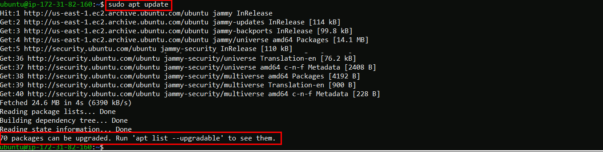
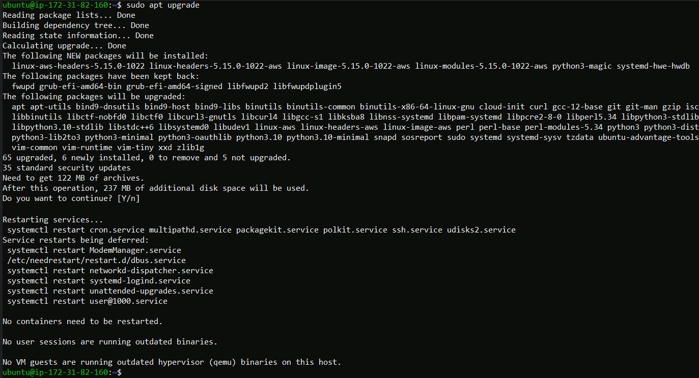
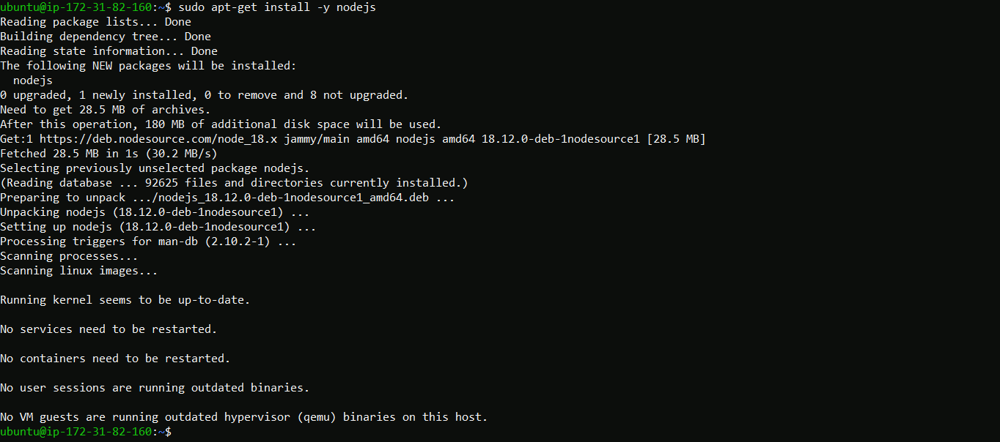
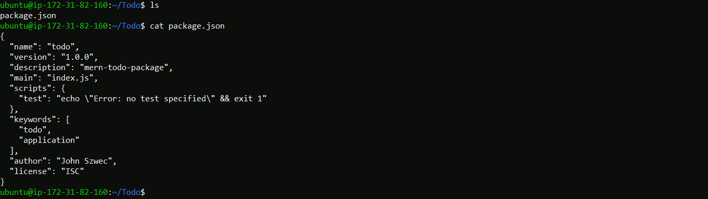

## This project requires implementing a web solution based on MERN stack in the AWS Cloud.
### A __MERN__ Web stack consists of following components:  

__* MongoDB:__ A document-based, No-SQL database used to store application data in a form of documents.  
__* ExpressJS:__ A server side Web Application framework for Node.js.  
__* ReactJS:__ A frontend framework developed by Facebook. It is based on JavaScript, used to build User Interface (UI) components.  
__* Node.js:__ A JavaScript runtime environment. It is used to run JavaScript on a machine rather than in a browser.  

###### * This project has a prerequistie of creating an Ubuntu EC2 instance on my personal AWS account. That instance has a security policy attached which allows me to log into it using SSH on port22 from my local laptop. The creation and setup of this instance is not documented here. 
___
### 
 Step 1) – BACKEND CONFIGURATION 

* Step 1 sub steps
  * Upgrade Ubuntu
  * Install NPM and NodeJS
  * Create a directory and initialize our project application in it.
   
 __Run update to fetch the updated metadata on the packages.__

__Run Upgrade to get packages on the newest versions__

